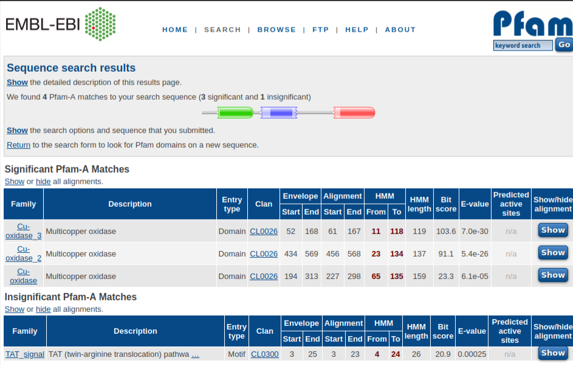
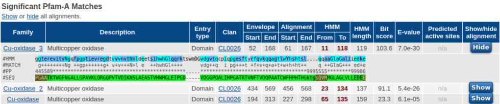

# PFAM: Eines per investigar relacions seqüència-estructura-funció de proteïnes


<!-- @import "[TOC]" {cmd="toc" depthFrom=1 depthTo=6 orderedList=false} -->

<!-- code_chunk_output -->

- [PFAM: Eines per investigar relacions seqüència-estructura-funció de proteïnes](#pfam-eines-per-investigar-relacions-seqüència-estructura-funció-de-proteïnes)
  - [Cerques de semblança](#cerques-de-semblança)
    - [Models de Markov ocults (HMM de perfil)](#models-de-markov-ocults-hmm-de-perfil)
  - [PFAM](#pfam)
    - [Què és Pfam?](#què-és-pfam)
    - [Per què necessitem Pfam?](#per-què-necessitem-pfam)
    - [Què podem fer amb Pfam?](#què-podem-fer-amb-pfam)
    - [Famílies i clans Pfam](#famílies-i-clans-pfam)
      - [1) Domini:](#domini)
      - [2) Família:](#família)
      - [3) Repetiu:](#repetiu)
      - [4) Motiu:](#motiu)
      - [5) Bobina enrotllada (_coiled-coil_):](#bobina-enrotllada-_coiled-coil_)
      - [6) Desordenat:](#desordenat)
    - [Què és un clan Pfam?](#què-és-un-clan-pfam)
  - [Com començar amb Pfam](#com-començar-amb-pfam)
    - [Cerca i visualització de dades: seqüència](#cerca-i-visualització-de-dades-seqüència)
  - [Visualització dels resultats](#visualització-dels-resultats)
  - [Què vol dir la representació gràfica?](#què-vol-dir-la-representació-gràfica)
  - [Comparant la vostra seqüència amb models familiars](#comparant-la-vostra-seqüència-amb-models-familiars)
  - [Cerca i visualització de dades: famílies](#cerca-i-visualització-de-dades-famílies)

<!-- /code_chunk_output -->


## Cerques de semblança

La cerca en bases de dades s'utilitza àmpliament en bioinformàtica i hi ha diverses maneres diferents
per fer cerques en bases de dades de proteïnes. Per exemple, algorismes d'alineació com BLAST [Altschul et al., 1990]
i Smith-Waterman [Smith i Waterman, 1981] comparen dues seqüències i determinen la seva
semblances per associació d'una única puntuació per a cada substitució donada d'un aminoàcid amb
un altre utilitzant matrius de substitució estàndard i puntuacions de penalització per bretxa. Aquest tipus de seqüències-
les comparacions per parelles basades en calculen la similitud entre dues seqüències per identificar-ne parts significatives. Que dues seqüències es considerin similars a un nivell significatiu, indica compartides
propietats biològiques com origen evolutiu comú, estructura molecular similar i similar
funcionalitat.
Com que les posicions específiques i els aminoàcids específics poden no tenir necessàriament la mateixa conservació, pot ser millor cercar la família o
semblança de domini en lloc de cercar semblança de seqüència. Pot ser més beneficiós cercar
per a la similitud utilitzant puntuacions de substitució que reflecteixin les freqüències de les posicions dels aminoàcids individuals de
moltes seqüències en un domini, en lloc d'utilitzar puntuacions de substitució estàndard que reflecteixin només una
substituint l'aminoàcid per un altre, un a un al llarg de les seqüències buscades. 

### Models de Markov ocults (HMM de perfil)

"Un model de Markov ocult descriu una distribució de probabilitat sobre un nombre potencialment infinit de
seqüències" [Eddy, 1998]. 
Un perfil HMM conté estats per a la concordança, inserció i supressió que s'utilitzen per modelar una
família de seqüències. Cada estat del model té distribucions de probabilitat i cada transició té a
probabilitat. Per tant, si teniu un aminoàcid representat habitualment en una posició determinada del
l'alineació de múltiples seqüències obté una puntuació més alta. També possibilita assignar puntuacions
insercions i supressions en posicions específiques. Es compara una seqüència amb el model mitjançant l'assignació
els residus de la seqüència als estats de l'HMM. La puntuació resultant és una probabilitat per a
la seqüència que s'ha de relacionar amb el model donat i la probabilitat s'utilitza per trobar un valor e per
el partit.

La idea d'utilitzar HMM de perfil per a la cerca de bases de dades és comparar una seqüència amb un 
model estadístic que descriu una família o un patró de seqüències (contrari a una simple comparació d'un sol
aminoàcids de dues seqüències). Comparant una seqüència amb un model estadístic es pot obtenir
alguna informació addicional. Per exemple
* algunes posicions poden conservar-se per a residus específics, mentre que altres ja són considerables
variacions;
* algunes posicions poden haver estat eliminades sense afectar la funcionalitat mentre que altres posicions són essencials;
* les insercions poden ser acceptables en algunes posicions, mentre no ser-ho a altres.


## PFAM


### Què és Pfam?

(Traduït i adaptat del [PFAM quick Tour](https://www.ebi.ac.uk/training/online/courses/pfam-quick-tour/what-is-pfam/) de l'[European Bioinformatics Institute](https://www.ebi.ac.uk/) (EMBL-EBI))

Les proteïnes generalment tenen una o més regions funcionals, que comunment s'anomenen "dominis". La presència de diferents dominis en diferents combinacions sobre diferents proteïnes dóna lloc al variat repertori funcional  que es troba a la natura. La identificació dels dominis presents en una proteïna pot proporcionar una visió de la seva funció. **[Pfam](https://pfam.xfam.org/)** és una base de dades d'aquestes unitats evolutives conservades.

Cada entrada de Pfam està representada per un conjunt de seqüències alineades amb la seva representació probabilística, anomenada perfil de model de Markov (HMM) ocult. El perfil HMM s'entrena en un petit conjunt representatiu de seqüències alineades que se sap que pertanyen a la família (l'alineació "llavor"). Després, aquest model s'utilitza per cercar exhaustivament en una gran base de dades de seqüències (per exemple, [UniProtKB](https://www.uniprot.org/help/uniprotkb)) per trobar totes les seqüències homòlogues. Aquelles seqüències que són significativament similars al model s'alineen amb el perfil HMM per tal de proporcionar l'alineació completa.

Les entrades relacionades de Pfam es poden agrupar en conjunts, etiquetats com a "Clans". Normalment són superfamílies grans i divergents, on un únic perfil HMM és insuficient per capturar tots els membres d'una seqüència.

### Per què necessitem Pfam?

La nostra capacitat de generar dades de seqüències supera amb escreix la velocitat a la qual podem caracteritzar funcionalment les seqüències experimentalment. Per tant, es necessiten mètodes computacionals per ajudar a identificar regions de semblança entre seqüències. La concordança de seqüències amb una entrada de Pfam ens permet transferir la informació funcional d'una seqüència caracteritzada experimentalment a seqüències no caracteritzades a la mateixa entrada. Pfam proporciona una anotació completa per a cada entrada.

### Què podem fer amb Pfam?

Amb Pfam podem:

 * cercar la vostra proteïna o seqüència d'ADN amb els models existents;
 * explorar les  famílies i clans;
 * recuperar anotacions de text sobre qualsevol família/entrada determinada;
 * veure  alineacions múltiples de seqüències d'una família o clan;
 * veure les relacions entre les famílies d'un clan;
 * veure informació sobre l'estructura de proteïnes en el context d'una família;
 * veure les famílies segons la seva dispersió taxonòmica;
 * cercar la base de dades per paraules clau.

### Famílies i clans Pfam

Les entrades de Pfam es classifiquen en sis categories diferents, segons la longitud i la naturalesa de les regions de seqüència incloses a l'entrada:

#### 1) Domini:
Col·lecció de regions de seqüències relacionades que formen una unitat estructural diferent.

#### 2) Família:
Col·lecció de regions de seqüències relacionades que poden contenir un o més dominis, però on no hi ha proves suficients per donar suport a la subdivisió.

#### 3) Repetiu:
Una unitat curta que és inestable aïlladament però que forma una estructura estable quan hi ha diverses còpies.

#### 4) Motiu:
Una unitat curta que té un paper diferent, per exemple l'enllaç d'un ió metàl·lic.

#### 5) Bobina enrotllada (_coiled-coil_):
Regions d'una proteïna que formen hèlixs alfa que s'alineen entre si per formar una estructura distintiva anomenada bobina enrotllada.

)](../figures/GCN4_coiled_coil_dimer_1zik_rainbow.png)

#### 6) Desordenat:
Regions de proteïnes que estan inherentment desordenades però tenen conservació de seqüències.

### Què és un clan Pfam?

Les entrades Pfam relacionades s'agrupen en clans. La relació entre famílies d'un clan es pot definir per:

 * semblança de seqüències (tot i que encara prové d'un avantpassat comú);
 * semblança d'estructures tridimensionals conegudes;
 * semblança funcional;
* semblança entre els seus HMM de perfil, tal com determinen algorismes com HHsearch.

## Com començar amb Pfam

Pfam inclou pàgines separades per a cadascun dels tipus de dades següents:

* família
* clan
* seqüència
* estructura
* proteoma complet

Podeu consultar cadascuna de les pàgines anteriors utilitzant l'accés o el nom de l'entitat, o cercant paraules clau relacionades.

 a PFAM](../figures/pfam1.png)

Hi ha una sèrie d'"enllaços ràpids" disponibles a la pàgina d'inici de Pfam que us permeten consultar la base de dades mitjançant diversos mètodes diferents. Si feu clic a qualsevol dels enllaços ràpids  s'obrirà un quadre de diàleg per a aquest tipus de cerca en particular. Aquests inclouen: un nom de proteïna o accés (p. ex. VAV_HUMAN), un nom de família Pfam o accés (p. ex. PF00571), un nom de clan o accés (p. ex. ENTH_VHS), una accés PDB (p. ex. 2abl) o paraules clau (p. ex. 'RNA binding'). Es donen exemples addicionals sota cada encapçalament del lloc web.

Hi ha una opció per navegar pel contingut de la base de dades mitjançant la pestanya "Browser" a la part superior de la pàgina . Dins d'aquesta pàgina, les dades estan ordenades alfabèticament per "família", "clan" o "proteoma".

També hi ha l'opció de cercar per paraules clau mitjançant el quadre de cerca de paraules clau, que es pot trobar a l'extrem superior dret de cada pàgina.


### Cerca i visualització de dades: seqüència

Si feu clic a la pestanya ["Search"](https://pfam.xfam.org/search#tabview=tab1) a la part superior de la pàgina d'inici s'obre la pàgina "Cerca Pfam", amb diverses opcions de cerca enumerades a la part esquerra. Un dels usos més valuosos de Pfam és trobar quina família (o famílies) coincideix amb una seqüència i, per tant, _quina pot ser la seva funció potencial_.

Podeu fer-ho enganxant una seqüència en format FASTA (proteïna o ADN) al quadre de diàleg de la seqüència. Això compara la seqüència enviada amb la base de dades Pfam utilitzant el valor E per defecte que es mostra (el valor mostrat a la pàgina és l'òptim per a evitar falsos positius).

](../figures/pfam2.png)

Cercarem aquesta seqüècia:

```fasta
>proteïna_X
MLRRDFIKLTAALGAASALPLWSRAAWAADRPALPVPPLLTPDAQGKIALALQAGETRWLPGAATKTWGF
NGALLGPAVKLQRGQPVTVDIKNSLAEASTVHWHGLEIPGDVDGGPQALIHPGATRTVNFTVDQPAATCW
FHPHTHGKTGSQVMMGLAGLVLLEDEESAKLPLPKTWGQDDIPVILQDKRLGKDAQIEYRLDVMSAAVGW
FGDRMFTNGAQYPQHLAPRGWLRLRFLNGCNARSLNLAASDNRPLYVIASDGGFLAEPVKLTELPMLMGE
RFEVLVDASDGKAFDIVTLPVKQMGMTLAPFDQALPVLRIQPSLAQGIKTMPDSLVKLPTLPATTGIQER
WLQLMMDPQLDMLGMQALMDRYGHQAMAGMSMNHGAPGGADMKGMEKGGMQSMDHGNMKGMEKGGMQGMD
HGNMGNMGNMKGMDHGNMAGMDHGGAQGKAKPFDFSHGNMINGKAFDMNKPMFAAKRGQYEKWTISGEGD
MMLHPFHIHGTQFRILSENGKPPAAHRSGWKDTVRVEGWRSEVLVRFDHPASSEHAYMAHCHLLEHEDTG
MMMGFTVAD
```

## Visualització dels resultats

Com es demostra a continuació, aquesta seqüència té coincidències significatives amb tres famílies diferents al llarg de la seva longitud.



La columna Família mostra quines famílies Pfam es troben a la seqüència consultada. Els _E-value_ i els _Bit-score_ indiquen la importància dels resultats. Els detalls dels residus que pertanyen a cada família estan disponibles a l'opció _"Show"_ que mostra l'alineació entre la consulta i l'HMM coincident.

## Què vol dir la representació gràfica?

Cada família Pfam es mostra amb un color al llarg de la seqüència consultada. El nom del domini es mostra dins de la representació gràfica. Si les seqüències consultades coincideixen amb l'alineació completa del domini, el gràfic del domini complet es mostra amb vores arrodonides. Tanmateix, si la seqüència consultada no coincideix amb la longitud completa del model HMM del domini, la representació gràfica del domini es mostra amb una vora irregular dins de 5 posicions de la primera o darrera posició del perfil HMM. 

## Comparant la vostra seqüència amb models familiars

Les vistes d'alineament us mostren fins a quin punt la vostra seqüència coincideix amb els models HMMI de la família.



A la columna de la família:

* #HMM representa la seqüència de consens (probablement d'aquest model familiar)
* #MATCH mostra si s'accepta o no un residu de la vostra seqüència
* #PP (probabilitat posterior) dóna una puntuació per a la posició de l'1 al 10, on *=10 és el millor
* #SEQ mostra els residus de la vostra seqüència d'entrada

Podeu fer clic als noms o a les icones de la família/domini per redirigir a la pàgina de la família. A la pàgina familiar es descriu informació sobre l'estructura, la funció i la relació amb altres famílies. Les referències bibliogràfiques també es proporcionen a la part inferior de cada secció, vegeu un exemple a la secció següent. 


## Cerca i visualització de dades: famílies

Les pàgines de la família contenen totes les dades relatives a qualsevol entrada en particular. Tingueu en compte que ens referim a això com a "pàgina de la família", però pot ser qualsevol tipus d'entrada, inclòs domini, motiu, repetició, etc.


[Eddy, 1998] Eddy, S. (1998). Profile hidden Markov models. Bioinformatics, 14:755--763.